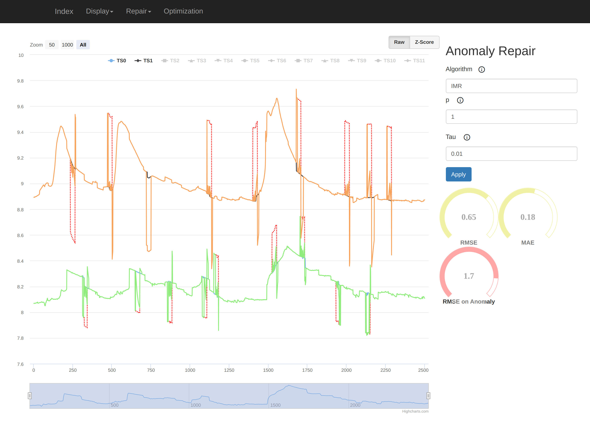
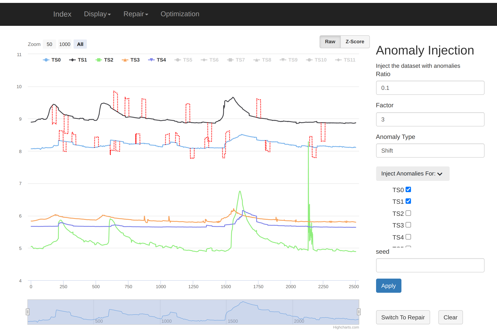
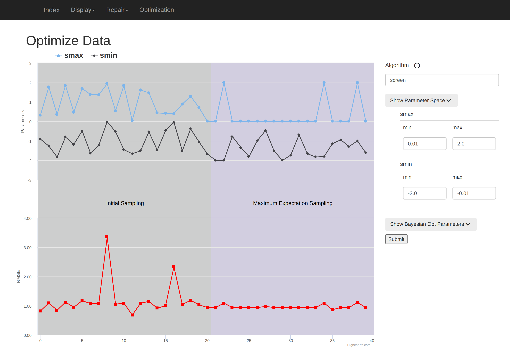

# RepBench 
RepBench is a tool for measuring and comparing the performance of algorithms repairing anomalies in datasets. It offers various algorithms and metrics for evaluating the effectiveness of anomaly repair under different contamination conditions. Users can introduce different types of anomalies into datasets and use the RepBench web application to view the data, repair results, and experiment with algorithm parameters.


[**Prerequisites**](#prerequisites) | [**Build**](#build) |[**Repair**](#anomaly-repair) | [**Injection**](#anomaly-injection)|[**RepBench Web Application**](#web-tool) 


# Anomaly Repair 
This benchmark implements four different anomaly repair techniques in time series and evaluates their precision and runtime on various real-world time series datasets using different repair scenarios.

- The benchmark implements the following algorithms: [IMR](https://www.vldb.org/pvldb/vol10/p1046-song.pdf), [SCREEN](https://dl.acm.org/doi/pdf/10.1145/2723372.2723730), Robust PCA and CDrep.
- All the datasets used in this benchmark can be found [here](https://github.com/althausLuca/RepairBenchmark/tree/master/data).
- The full list of repair scenarios can be found [here](https://github.com/althausLuca/RepairBenchmark/tree/master/injection/scenarios/README.md).


___

## Prerequisites
- Ubuntu 22 or Ubuntu 22 (including Ubuntu derivatives, e.g., Xubuntu).
- Clone this repository.

___


## Build

install python and pip
```bash
$ sudo apt install python3-dev
$ sudo apt install python3-pip
```

create a activate a virtual environment
```bash
$ sudo apt install python3-venv
$ python3 -m venv venv
$ source venv/bin/activate
```

install the requirements for the Benchmark
```bash
    $ sh install.sh
```

To use the WebApp, you need to install additional requirements

```bash
    $ cd RepBenchWeb
    $ pip3 install -r requirements.txt
    $ cd ..
```
___
## Execution
```bash
$ python3 TestingFramework.py -d dataset -a anomaly_type -scen scenario_type -alg algorithm
```
### Arguments

| dataset  | anonaly_type  | scenario_type | algorithm | 
| -------- | -------- |---------------| -------- | 
| bafu5k     | shift   | ts_len        | rpca
 | humidity   |distortion  | a_size        | screen
 | msd1_5     | outlier    | a_rate        | imr
 | msd_hc     | all        | ts_nbr        | cdrec
 |  elec      |            | cts_nbr       | all
|           |            | a_factor      | all
 |   all      |             | all           | |      


### Data
- The data has to have a csv format.
- The data argument expects the Data to be in the data folder.


### Results
All results and plots will be added to `Results` folder. The accuracy results of all algorithms will be sequentially added for each scenario, dataset and anomaly type to: `Results/.../.../precision/error/`. The runtime results of all algorithms will be added to: `Results/.../.../runtime/`. The plots of some anomaylous parts of the time series together with its repair will be added to the folder `Results/.../precision/repair/`.

#### Parameters
The Parameters of the algorithms can be modified in [here](https://github.com/althausLuca/RepairBenchmark/blob/master/algorithms/parameters.toml)


### Examples
1.  Run a single algorithm (cdrec) on a single dataset (bafu5k) using one scenario (number of time series) and one anomaly (shift)

```bash
python3 TestingFramework.py -d bafu5k -scen ts_nbr  -a shift -alg cdrec
```
2. Run two algorithms (cdrec, rpca) on two dataset (bafu5k,msd) using one scenario (a_rate) and two anomalies (shift,outlier)

```bash
python3 TestingFramework.py  -d bafu5k,msd -scen ts_nbr -a shift,outlier -alg cdrec,rpca
```
 3. Run the whole benchmark: all the algorithms , all the dataset on all scenarios with all anomalies (takes 6 hours)

```bash
python3 TestingFramework.py -d all -scen all  -a all -alg all
```


 

# Anomaly Injection
## Execution
```bash
$ python3 inject.py -d dataset -a anomaly_type -f factor/amplitude -r rate -ts time_series [-l lenght ]
```

## Arguments
- `-d` : Required. Dataset to inject anomalies into.
- `-a` : Required. Anomaly type to be injected. Choices are shift,distortion,outlier
- `-f` : Required. Factor to control the strength of the anomalies.
- `-r` : Required. Ratio of data points affected by the anomalies.
- `-ts`: Required ts index to be injected starting from 1 , multiple indices can be specified separated by comma e.g -ts `1,2,3`
- `-l` : Optional. The length of the time series. Default value is 30.

The  Resulting Injected Data set is stored in `injection/Results`.
The input file must be in csv format without timestamps and  the data folder is `data/full`.

## Examples
1. Inject a shift anomaly with factor 4 and ratio 0.1 into the first time series of the dataset bafu5k with length 30.

```bash
python3 inject.py -d bafu5k -a shift -f 4 -r 0.1 -ts 1  -l 30
```
2. Inject a distortion anomaly with factor 2 and ratio 0.2 into the first and second time series of the dataset: elec with length 10.

```bash
python3 inject.py -d elec -a distortion -f 2 -r 0.2 -ts 1,2 -l 10
```

3. Inject an outlier anomaly with factor 3 and ratio 0.25 into the first, second and third time series of the dataset humidity.

```bash
python3 inject.py -d humidity -a outlier -f 3 -r 0.25 -ts 1,2,3 
```


# Web Tool

## Execution

### First time
```bash
python3 manage.py makemigrations
python3 manage.py migrate
```
### Run
```bash
python3 manage.py runserver
```


## Repair 
Directly repair a synthetic data set with anomalies and compare the repaired time series together with the original and injected series.
We show the conventional metrics for anomaly repair: root mean square error (RMSE) and mean absolute error (MAE).



## Injection 
Inject real-world data with anomalies. Select the time series and anomaly type to inject. Multiple injections are possible allowing for different anomaly types in a time series.  After contamination, it is possible to switch to the repair view to try out the a repair technique on the affected data, similar to the process used for synthetic data.




## Optimization
Run an experiment using Bayesian optimization on a set of synthetic data by defining the range of parameters to test and the optimization algorithm. Visualize the results by plotting the error being minimized and the specific parameter values used in each step of the optimization process.




